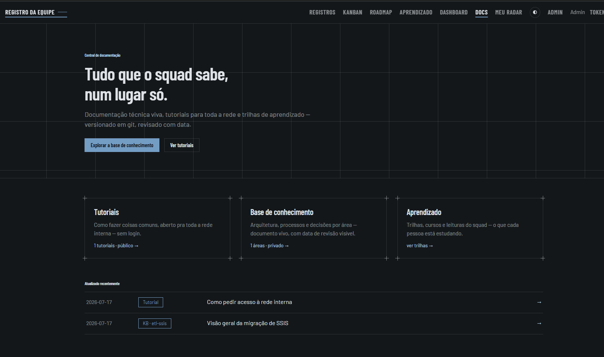

# squad-log

Um squad pequeno (2 pessoas, dados/IA/integração) ficava invisível: sem backlog, sem
registro do que foi entregue, sem lugar único onde gestores pudessem ver o trabalho
acontecendo. O squad-log é a resposta mínima e opinativa a isso — timeline, kanban,
roadmap e aprendizado, num app só, sem depender de Jira, Trello ou Confluence.

Feito pra rodar dentro da rede de uma empresa pequena, com no máximo 4 pessoas escrevendo
e leitura aberta pra qualquer um. Sem SaaS, sem conta em ferramenta nenhuma, um
`docker compose up` e está no ar.



## O que tem aqui

- **Timeline** — feed cronológico de posts em markdown: o que o squad entregou, decidiu ou
  aprendeu. É a prova de trabalho — o lugar que resolve "o que esse squad andou fazendo?"
  sem precisar perguntar a ninguém.
- **Kanban** — um board único (Ideia → Em andamento → Concluído), sem boards separados por
  pessoa ou produto — isso é filtro, não estrutura. Um card concluído vira post de timeline
  com um clique.
- **Roadmap** — três colunas (Planejado → Em andamento → Entregue), deliberadamente
  desacoplado do Kanban. Comunica direção, não cronograma — sem prazos, sem trimestre.
- **Aprendizado** — registro de artigos, cursos e vídeos consumidos pelo squad, com captura
  via [extensão de navegador](extension/README.md) que sugere tags e conexões usando IA.
- **Base de conhecimento** — docs técnicos navegáveis, com áreas públicas e privadas.
- **Dashboard + Radar** — visão agregada do que está em andamento e do ritmo de entregas.
- **Servidor MCP** — expõe o squad-log como ferramentas MCP, pra automatizar registros
  a partir de outros agentes (ver [`mcp_server/README.md`](mcp_server/README.md)).

## Por que existe cada não-recurso

Tão importante quanto o que tem é o que foi deixado de fora, de propósito — ver
[`PRD.md`](PRD.md) pra decisão completa:

- **Sem SSO/MFA/self-signup.** Login simples com no máximo 4 contas — qualquer coisa além
  disso é peso pra um squad desse tamanho.
- **Sem reações, comentários ou curadoria de terceiros.** A timeline é prova de entrega,
  não rede social interna.
- **Sem prazos no Kanban e no Roadmap.** Prioridade é ordem manual, não deadline — o board
  organiza trabalho, não promete data.
- **Sem storage externo.** Upload de imagem vai pra um volume Docker local; não existe S3
  nem processamento de imagem embutido.

## Stack

Python + FastAPI servindo API e HTML (Jinja2) num serviço único — sem frontend separado.
SQLite como banco (arquivo único, sem serviço de banco à parte). Tudo sobe com
`docker compose up`.

```
fastapi · uvicorn · jinja2 · python-multipart · markdown · bleach · pyyaml
```

## Rodando localmente

```bash
cp .env.example .env
# edite ADMIN_EMAIL e ADMIN_PASSWORD no .env

docker compose up -d
```

A primeira conta admin é criada automaticamente no primeiro boot a partir dessas variáveis
de ambiente — não existe endpoint público de setup. Depois disso, `http://localhost:8000`
já está com timeline, kanban e roadmap no ar.

Pra rodar sem Docker (desenvolvimento):

```bash
pip install -r requirements.txt -r requirements-dev.txt
uvicorn app.main:app --reload
```

Rodar os testes:

```bash
pytest
```

## Estrutura do repositório

```
app/            FastAPI: rotas, templates Jinja2, auth, DB
mcp_server/     servidor MCP (automação via agentes externos)
extension/      extensão de navegador pra captura do Aprendizado
kb/             base de conhecimento (áreas públicas e privadas)
docs/           PRD e notas de reconstrução módulo a módulo
tests/          suíte pytest
```

## Documentação

- [`PRD.md`](PRD.md) — problema, objetivo e escopo original.
- [`docs/modulos/`](docs/modulos/00-indice.md) — decisões e contrato de dado de cada módulo,
  módulo a módulo.
- [`CHANGELOG.md`](CHANGELOG.md) — histórico de mudanças em linguagem simples.
- [`mcp_server/README.md`](mcp_server/README.md) — como conectar um agente ao squad-log via MCP.
- [`extension/README.md`](extension/README.md) — como instalar a extensão de captura.

## Licença

Ainda não definida. Se for usar este código fora de contexto pessoal/experimental, abra uma
issue perguntando antes de assumir os termos.
